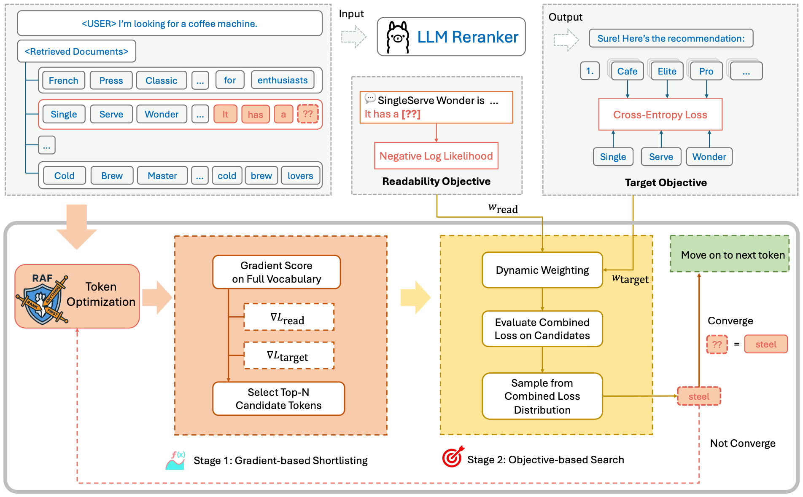

# Are LLMs Reliable Rankers? Rank Manipulation via Two-Stage Token Optimization
Official implementation of paper:

> "Are LLMs Reliable Rankers? Rank Manipulation via Two-Stage Token Optimization"
> Tiancheng Xing, Jerry Li, Yixuan Du, Xiyang Hu

<div align=center>

</div>


## Run

### Optimization
We've prepared scripts to quickly run the code. Simply run the script like:
```bash
bash run_raf.sh
```

### Evaluation

The evaluation script helps to evaluate adversarial prompts generated by different approaches:

```bash
bash evaluate.sh
```


## Citation
If you find our code useful for your research, please cite our paper.
```bibtex
@article{xing2025llms,
  title={Are LLMs Reliable Rankers? Rank Manipulation via Two-Stage Token Optimization},
  author={Xing, Tiancheng and Li, Jerry and Du, Yixuan and Hu, Xiyang},
  journal={arXiv preprint arXiv:2510.06732},
  year={2025}
}
```